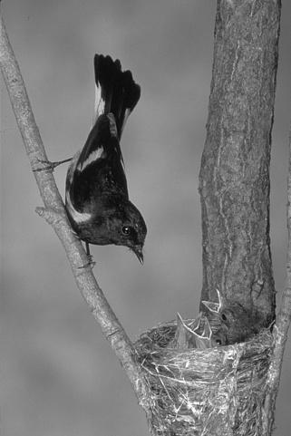
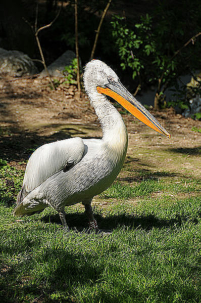

# CUDA-Programming (Image Processing)

This repository contains CUDA-based programs that demonstrate how to apply filters to images using parallel processing on NVIDIA GPUs. 

### Grayscale Image Processing (PGM Format):

Loads a grayscale PGM (P5) image.
Applies a basic 3x3 convolution filter for image smoothing using CUDA, then aves the processed image back in PGM format.

<figure>


</figure>

<br>

### RGB Image Processing with Edge Enhancement (PPM Format):

Loads an RGB PPM (P3) image, applies an edge enhancement filter (Laplacian kernel) to each color channel using CUDA, then saves the processed RGB image in PPM format.

<figure>


</figure>

### Features
CUDA-Accelerated Filtering: Utilizes GPU parallelism to speed up image processing.

### Requirements
NVIDIA GPU with CUDA support.
CUDA Toolkit installed.

## Compilation

```bash
nvcc smooth_filter.cu -o ./smooth  # (.\smooth.exe on windows)
```
```bash
nvcc edge_filter.cu -o ./edgefilter # (.\edgefilter.exe on windows)
```

<br>

## Execution
```bash
./smooth  # For PGM image processing
```

```bash
./edgefilter  # For PPM image processing

```


## Image Formats
PGM (P5): A simple grayscale image format where each pixel is represented by a single intensity value.

PPM (P3): A text-based RGB image format where each pixel is represented by three values: red, green, and blue.


This repository serves as a foundational example for image processing using CUDA and can be extended to more complex operations like Gaussian blur, sharpening, and other convolution-based filters.

